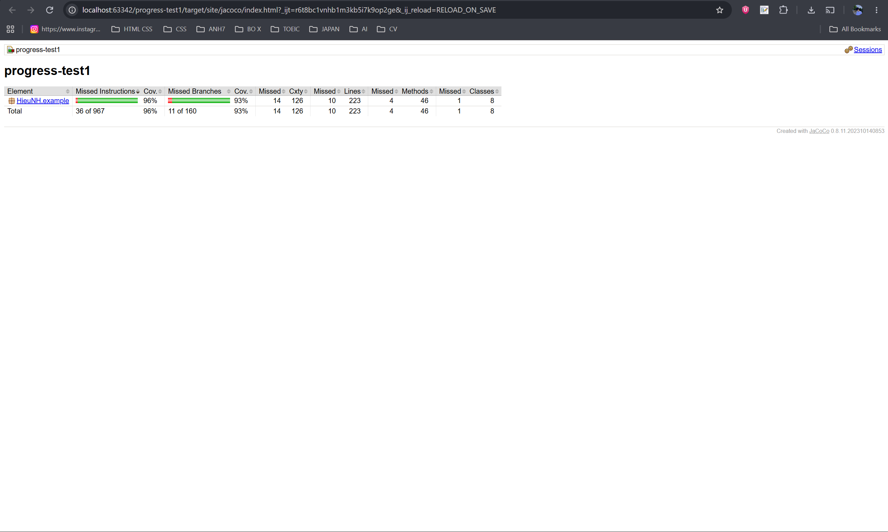
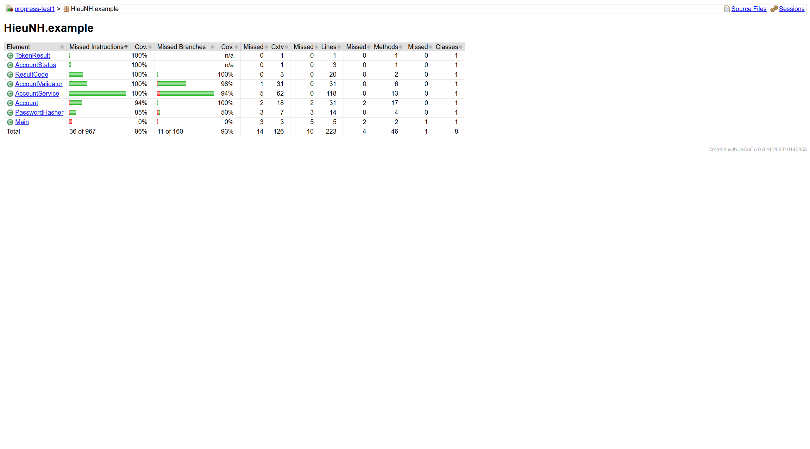
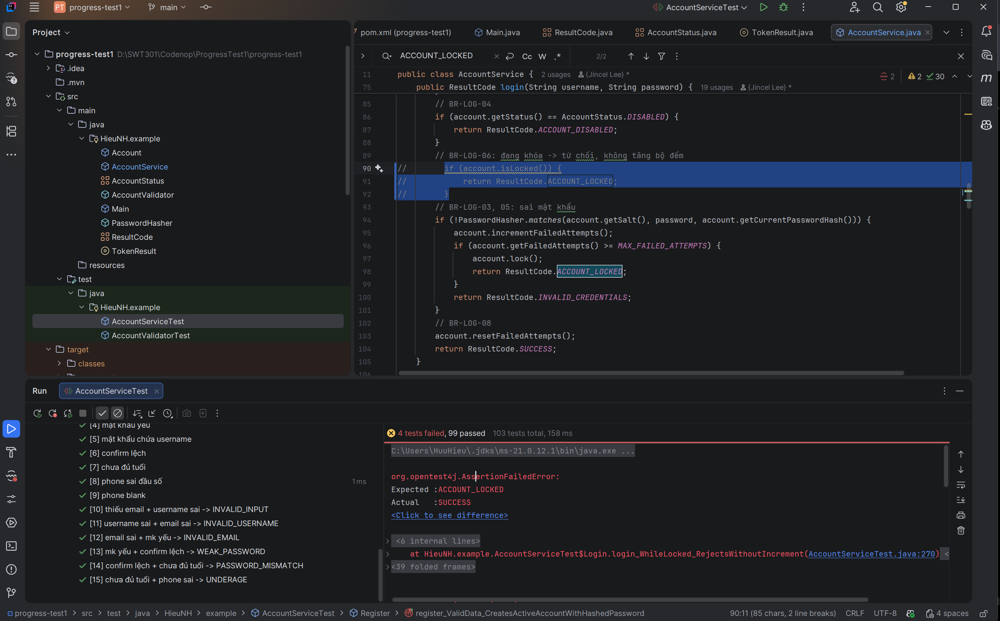

# SWT301 - Progress Test 1
## Unit Testing with JUnit 5

**Student:** Nguyen Huu Hieu  
**Student ID:** DE200046

## Project Overview

This project implements and tests an Account Management system using JUnit 5 and Parameterized Tests.

Main functions:
- Account validation
- Account registration
- Login
- Account locking after 5 failed login attempts
- Account unlocking
- Account disabling
- Account lookup

## Technologies

- Java 21
- Maven
- JUnit Jupiter 5.10.2
- JaCoCo 0.8.11
- Git

## How to Run

Run all tests:

```bash
mvn clean test
```

Run AccountValidator tests:

```bash
mvn -Dtest=AccountValidatorTest test
```

Run AccountService tests:

```bash
mvn -Dtest=AccountServiceTest test
```

## JaCoCo Coverage

Required coverage:
- Line Coverage >= 80%
- Branch Coverage >= 70%

| Core Class | Line Coverage | Branch Coverage | Result |
|---|---:|---:|---|
| `AccountValidator` | 100% | 98% | PASS |
| `AccountService` | 100% | 94% | PASS |

### Overall Coverage



### Core Classes Coverage



Both core classes satisfy the required Line and Branch Coverage targets.

## Manual Mutation Testing

Three manual mutations were performed. Each injected fault was detected by at least one test, and the production code was restored after each mutation.

| # | Injected Fault | Failed Test | Restored |
|---|---|---|---|
| M1 | `>= MAX_FAILED_ATTEMPTS` → `>` | `login_WrongPassword5thTime_LocksAccount` | ✅ |
| M2 | Removed `if (account.isLocked())` | `login_WhileLocked_RejectsWithoutIncrement` | ✅ |
| M3 | `{4,19}` → `{4,20}` | `isValidUsername_BoundaryLength` | ✅ |

### Mutation Example



## Final Result

- All core tests pass.
- `AccountValidator`: 100% Line Coverage, 98% Branch Coverage.
- `AccountService`: 100% Line Coverage, 94% Branch Coverage.
- Registration validation order is covered.
- Login decision table is covered.
- Failed login boundary at attempts 4 and 5 is covered.
- Three manual mutations were detected by the test suite.
- Production code was restored after mutation testing.